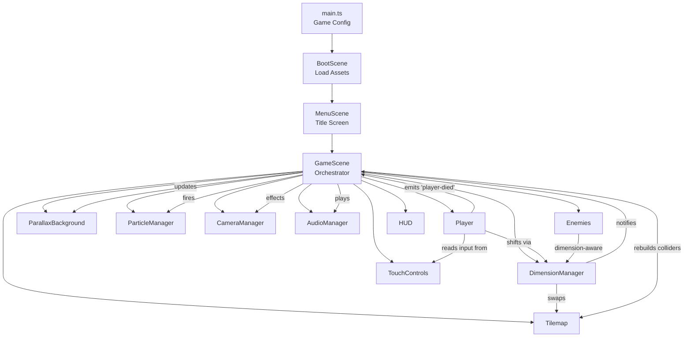

# 🎮 SHIFT — Game Development Guide

> **A complete, beginner-to-advanced walkthrough of how this game works.**
>
> This guide takes you from "what is a game loop?" all the way through every system in SHIFT. It's designed for people seeing game code for the first time, but has enough depth for experienced developers to learn from too.
>
> Every code example below comes directly from SHIFT's source files. No pseudocode — everything here is real and runnable.

---

## Table of Contents

1.  [The Very Basics — What IS a Game?](#1-the-very-basics--what-is-a-game)
2.  [Project Setup — Phaser + TypeScript + Vite](#2-project-setup--phaser--typescript--vite)
3.  [The Entry Point — `main.ts`](#3-the-entry-point--maints)
4.  [Scenes — The Building Blocks](#4-scenes--the-building-blocks)
5.  [Constants — The Tuning Panel](#5-constants--the-tuning-panel)
6.  [Procedural Textures — Art Without Artists](#6-procedural-textures--art-without-artists)
7.  [Tilemaps — Building Levels from Numbers](#7-tilemaps--building-levels-from-numbers)
8.  [The Player — Movement, Physics & State](#8-the-player--movement-physics--state)
9.  [The Dimension Mechanic — The Core Idea](#9-the-dimension-mechanic--the-core-idea)
10. [Enemies — AI & Combat](#10-enemies--ai--combat)
11. [Camera — Smooth Follow & Effects](#11-camera--smooth-follow--effects)
12. [Parallax Background — Depth Illusion](#12-parallax-background--depth-illusion)
13. [Particles — Making Things Feel Alive](#13-particles--making-things-feel-alive)
14. [Audio — Procedural Sound Effects](#14-audio--procedural-sound-effects)
15. [HUD — Heads-Up Display](#15-hud--heads-up-display)
16. [Game Flow — Pause, Death & Victory](#16-game-flow--pause-death--victory)
17. [Mobile — Touch Controls](#17-mobile--touch-controls)
18. [Scaling — Fitting Every Screen](#18-scaling--fitting-every-screen)
19. [Architecture Overview — How It All Connects](#19-architecture-overview--how-it-all-connects)
20. [Tips for Extending SHIFT](#20-tips-for-extending-shift)

---

## 1. The Very Basics — What IS a Game?

At its core, every video game is just a loop that repeats ~60 times per second:

```
┌────────────────────────────────────────┐
│                                        │
│   1. READ INPUT   (keyboard, touch)    │
│   2. UPDATE STATE (move player, AI)    │
│   3. RENDER       (draw everything)    │
│   4. REPEAT       (go to step 1)       │
│                                        │
└────────────────────────────────────────┘
```

This is called the **game loop**. Each iteration is one **frame**. At 60fps (frames per second), you get 16.6 milliseconds per frame. If your update+render takes longer than that, the game appears to stutter.

**Key insight:** The game doesn't wait for the player to do something. It's constantly running — updating physics, checking collisions, redrawing everything — whether the player is pressing buttons or not. This is fundamentally different from a web app, where code only runs in response to events.

### Frame Rate Independence

A common beginner mistake is writing movement like this:

```typescript
// BAD: This runs at different speeds on different computers!
player.x += 5; // 5 pixels per frame
// On a fast PC (120fps): 600 pixels/second
// On a slow phone (30fps): 150 pixels/second 😱
```

The fix is to use **delta time** — the number of milliseconds since the last frame:

```typescript
// GOOD: Frame-rate independent!
player.x += 200 * (delta / 1000); // 200 pixels per SECOND, always
```

In SHIFT, Phaser handles this automatically for physics-based movement. But we use `delta` explicitly for timers like coyote time and jump buffering (more on those later).

---

## 2. Project Setup — Phaser + TypeScript + Vite

### The Stack

| Tool           | Why We Use It                                                      |
| -------------- | ------------------------------------------------------------------ |
| **Phaser 3**   | Game framework — handles rendering, physics, input, audio, sprites |
| **TypeScript** | Type-safe JavaScript — catches bugs before they happen             |
| **Vite**       | Dev server with hot reload — see changes instantly                 |

### Project Structure

```
shift/
├── index.html              ← The web page. Phaser injects a <canvas> here
├── package.json            ← Dependencies: phaser, typescript, vite
├── tsconfig.json           ← TypeScript configuration
│
├── assets/                 ← Real art & audio files
│   ├── character/          ←   Player sprite animations
│   ├── enemies/            ←   Enemy sprites
│   ├── tiles/              ←   Tile images (ground, platform, wall)
│   ├── bg/                 ←   Background images
│   └── music/              ←   BGM tracks
│
└── src/                    ← All game code
    ├── main.ts             ← ★ Entry point — game config + launch
    ├── scenes/             ← Game scenes (Boot → Menu → Game)
    │   ├── BootScene.ts    ←   Loads assets, generates textures
    │   ├── MenuScene.ts    ←   Title screen
    │   └── GameScene.ts    ←   Main gameplay (the big one!)
    ├── entities/           ← Things that exist in the world
    │   ├── Player.ts       ←   Player character
    │   └── Enemy.ts        ←   Enemy base class
    ├── systems/            ← Game-wide managers
    │   ├── DimensionManager.ts    ← ★ The core mechanic
    │   ├── ParallaxBackground.ts  ←   Scrolling backgrounds
    │   ├── ParticleManager.ts     ←   Visual effects
    │   ├── CameraManager.ts       ←   Camera behavior
    │   ├── AudioManager.ts        ←   Sound effects
    │   └── TouchControls.ts       ←   Mobile input
    ├── levels/
    │   └── LevelData.ts    ←   10 levels as 2D number arrays
    └── utils/
        ├── Constants.ts    ←   All tunable game values
        ├── TextureGenerator.ts  ← Procedural sprite creation
        └── AssetKeys.ts    ←   Centralized texture key registry
```

### How to Run

```bash
npm install       # Install Phaser, TypeScript, Vite
npm run dev       # Start dev server at http://localhost:5173
```

Vite watches your files and hot-reloads the browser on every save. No manual refreshing needed.

---

## 3. The Entry Point — `main.ts`

Every Phaser game starts with a single configuration object:

```typescript
// main.ts — THE starting point
import Phaser from "phaser";

const config: Phaser.Types.Core.GameConfig = {
  type: Phaser.AUTO, // WebGL if available, Canvas fallback
  width: 960, // Game canvas width in pixels
  height: 640, // Game canvas height in pixels
  parent: "game-container", // HTML element ID to inject <canvas> into
  pixelArt: true, // Keep pixel art crisp (nearest-neighbor scaling)
  backgroundColor: "#0a0a1a",

  physics: {
    default: "arcade", // Simple rectangle-based physics
    arcade: {
      gravity: { x: 0, y: 800 }, // Downward gravity: 800 px/s²
      debug: false, // Set true to see collision boxes!
    },
  },

  scene: [BootScene, MenuScene, GameScene], // Load order
  scale: {
    mode: Phaser.Scale.FIT, // Scale to fit screen, no cropping
    autoCenter: Phaser.Scale.CENTER_BOTH, // Center on page
  },
};

// This single line starts the entire game:
new Phaser.Game(config);
```

### Key Decisions Explained

**`type: Phaser.AUTO`** — WebGL renders on the GPU (fast), Canvas2D renders on the CPU (universal). AUTO picks the best option.

**`pixelArt: true`** — Without this, scaling a 32px sprite to 64px would blur it. With it, each pixel stays crisp. Essential for retro-style games.

**`gravity: { y: 800 }`** — Phaser's Y-axis points DOWN (standard in screen coordinates). Positive Y velocity = falling. Negative Y velocity = jumping. This trips up every beginner.

**`Phaser.Scale.FIT`** — Scales the 960×640 canvas to fill the browser window while maintaining aspect ratio. No content is cropped. Any remaining space shows the page background color.

---

## 4. Scenes — The Building Blocks

### What is a Scene?

A scene is a self-contained game state. Think of it like a screen or page:

```
BootScene  ───→  MenuScene  ───→  GameScene
(loading)       (title screen)   (gameplay)
                     ↑               │
                     └───────────────┘
                    (quit to menu)
```

Each scene has three lifecycle methods that Phaser calls automatically:

```typescript
class MyScene extends Phaser.Scene {
  preload() {} // Load assets (images, audio, JSON)
  create() {} // Build the scene (create sprites, set up physics)
  update() {} // Runs EVERY FRAME (~60fps) — the game loop!
}
```

### BootScene — The Loading Screen

```
BootScene flow:
  1. Show loading bar
  2. Load all images (player sprites, tiles, backgrounds)
  3. Load all audio (BGM tracks)
  4. Generate procedural textures (particles, portal, spikes)
  5. Create sprite animations from loaded frames
  6. Transition to MenuScene
```

**Why a separate boot scene?** Assets take time to download. You can't draw a sprite that hasn't loaded yet. The boot scene ensures everything is ready before gameplay begins.

BootScene loads real art assets from the `assets/` directory:

```typescript
// Player idle animation — 4 frames
for (let i = 0; i < 4; i++) {
  this.load.image(
    `player-idle-${i}`,
    `assets/character/animations/breathing-idle/east/frame_00${i}.png`,
  );
}
```

Then creates Phaser animations from those frames:

```typescript
this.anims.create({
  key: "player-idle",
  frames: [
    { key: "player-idle-0" },
    { key: "player-idle-1" },
    { key: "player-idle-2" },
    { key: "player-idle-3" },
  ],
  frameRate: 6, // 6 frames per second
  repeat: -1, // -1 = loop forever
});
```

### MenuScene — First Impressions

The title screen creates the game's atmosphere before gameplay even starts:

```typescript
// Pulsing title text
this.tweens.add({
  targets: title,
  alpha: { from: 0.8, to: 1 },
  duration: 1500,
  yoyo: true, // Go back after reaching the end
  repeat: -1, // Loop forever
  ease: "Sine.InOut",
});
```

**Tweens** are one of the most powerful tools in Phaser. A tween smoothly animates ANY property of ANY object over time. You'll see them everywhere in SHIFT — fading text, pulsing lights, zoom effects, slide-ins.

The menu also adapts to the device:

```typescript
const isMobile = "ontouchstart" in window || navigator.maxTouchPoints > 0;

const startLabel = isMobile
  ? "[ Tap Anywhere to Start ]"
  : "[ Press ENTER or SPACE to Start ]";
```

### GameScene — Where Everything Happens

This is the **orchestrator** — the 850-line conductor that coordinates every system:

```
GameScene.create():
  1. Create ParallaxBackground
  2. Create Tilemap (from LevelData)
  3. Initialize DimensionManager (give it the two tile layers)
  4. Spawn Player
  5. Spawn Enemies
  6. Set up Physics Colliders
  7. Initialize Camera (follow player)
  8. Create HUD (hearts, dimension indicator)
  9. Create TouchControls (if mobile)
  10. Set up Keyboard Bindings (ESC = pause, SHIFT = dimension swap)
  11. Show Level Intro text
  12. Start BGM

GameScene.update() — runs 60x/sec:
  1. Skip if paused or game over
  2. Update Player (movement, input)
  3. Update Enemies (AI)
  4. Update Particles
  5. Update HUD
  6. Check if player reached the exit
```

---

## 5. Constants — The Tuning Panel

One of the most important files in any game. All "magic numbers" live here:

```typescript
// Constants.ts
export const PLAYER = {
  SPEED: 200, // Horizontal run speed (px/s)
  JUMP_VELOCITY: -420, // Negative = upward!
  WALL_SLIDE_SPEED: 60, // Slower fall on walls
  WALL_JUMP_VELOCITY_X: 250,
  WALL_JUMP_VELOCITY_Y: -380,
  COYOTE_TIME_MS: 100, // Grace period after leaving edge
  JUMP_BUFFER_MS: 100, // Pre-land jump input window
  MAX_HEALTH: 3,
  INVINCIBILITY_MS: 1000, // 1 second of i-frames after hit
  KNOCKBACK_X: 200,
  KNOCKBACK_Y: -200,
  BODY_WIDTH: 18, // Hitbox (smaller than sprite!)
  BODY_HEIGHT: 28,
} as const;

export const WORLD = {
  TILE_SIZE: 32,
  WIDTH: 960, // 30 tiles wide
  HEIGHT: 640, // 20 tiles tall
  TILES_X: 30,
  TILES_Y: 20,
} as const;
```

**Why `as const`?** It makes every value `readonly` at the type level. TypeScript will error if you accidentally write `PLAYER.SPEED = 300` somewhere. Game constants should never change at runtime.

**Pro tip:** When your game "doesn't feel right", you almost never need to rewrite code. You need to change these numbers. Is jumping too floaty? Increase `JUMP_VELOCITY` magnitude. Is the player getting hit too much? Increase `INVINCIBILITY_MS`. This file is your game-feel dial.

---

## 6. Procedural Textures — Art Without Artists

SHIFT generates fallback textures for particles, portals, and spikes entirely in code using Phaser's `Graphics` API:

```typescript
// TextureGenerator.ts
export function generateTextures(scene: Phaser.Scene): void {
  // Create a 4×4 pixel particle texture
  const gfx = scene.add.graphics();
  gfx.fillStyle(0xffffff);
  gfx.fillRect(0, 0, 4, 4);
  gfx.generateTexture("particle", 4, 4);
  gfx.destroy();
  // Now 'particle' can be used as a sprite texture anywhere!
}
```

The process is:

1. Create a `Graphics` object (invisible canvas)
2. Draw shapes on it (rectangles, circles, lines)
3. Call `generateTexture('name', width, height)` to save it as a reusable texture
4. Destroy the graphics object (it was just a scratch pad)

This means SHIFT can run with **zero external image files** for basic gameplay. The real art in `assets/` enhances the visuals, but the game still works without them.

**Why procedural textures?**

- No dependency on external artists
- Instant iteration — change a color constant and refresh
- Zero load time for generated assets
- Perfect for prototyping — build gameplay first, art later

---

## 7. Tilemaps — Building Levels from Numbers

### How Levels Are Defined

Each level is a 2D number array (20 rows × 30 columns = 600 tiles):

```typescript
// LevelData.ts
export const ALL_LEVELS: LevelDefinition[] = [
  {
    name: "The Fracture",
    subtitle: "Learn to walk between worlds",
    lumina: [
      [
        1, 1, 1, 1, 1, 1, 1, 1, 1, 1, 1, 1, 1, 1, 1, 1, 1, 1, 1, 1, 1, 1, 1, 1,
        1, 1, 1, 1, 1, 1,
      ],
      [
        1, 0, 0, 0, 0, 0, 0, 0, 0, 0, 0, 0, 0, 0, 0, 0, 0, 0, 0, 0, 0, 0, 0, 0,
        0, 0, 0, 0, 0, 1,
      ],
      // ... 18 more rows ...
      [
        1, 1, 1, 1, 1, 1, 1, 1, 1, 1, 1, 1, 1, 1, 1, 1, 1, 1, 1, 1, 1, 1, 1, 1,
        1, 1, 1, 1, 1, 1,
      ],
    ],
    umbra: [
      /* same format, different layout */
    ],
    playerSpawn: { x: 2, y: 18 },
    exit: { x: 27, y: 18 },
    enemies: [{ type: "patrol", x: 15, y: 18, dimension: "lumina" }],
  },
];
```

### Tile Types

| Value | Meaning       | Collision |
| ----- | ------------- | --------- |
| `0`   | Empty (air)   | No        |
| `1`   | Ground tile   | Yes       |
| `2`   | Platform tile | Yes       |
| `3`   | Wall tile     | Yes       |

### How the Tilemap Is Built

GameScene's `createTilemap()` converts these arrays into Phaser tilemap layers:

```typescript
private createTilemap(): void {
  // Step 1: Create a blank tilemap
  const map = this.make.tilemap({
    tileWidth: WORLD.TILE_SIZE,   // 32
    tileHeight: WORLD.TILE_SIZE,  // 32
    width: WORLD.TILES_X,        // 30
    height: WORLD.TILES_Y,       // 20
  });

  // Step 2: Add tilesets (link tile IDs to images)
  const luminaTileset = map.addTilesetImage('lumina-combined', 'tileset-lumina-combined');
  const umbraTileset = map.addTilesetImage('umbra-combined', 'tileset-umbra-combined');

  // Step 3: Create SEPARATE layers for each dimension
  this.luminaLayer = map.createBlankLayer('lumina', luminaTileset!)!;
  this.umbraLayer = map.createBlankLayer('umbra', umbraTileset!)!;

  // Step 4: Fill tiles from the level data arrays
  for (let y = 0; y < WORLD.TILES_Y; y++) {
    for (let x = 0; x < WORLD.TILES_X; x++) {
      const luminaTile = level.lumina[y][x];
      const umbraTile = level.umbra[y][x];
      if (luminaTile > 0) this.luminaLayer.putTileAt(luminaTile, x, y);
      if (umbraTile > 0) this.umbraLayer.putTileAt(umbraTile, x, y);
    }
  }
}
```

**The key insight:** Both dimensions' tiles are **always on screen**. The active dimension is fully visible with collisions ON. The inactive dimension is ghostly and transparent with collisions OFF. The DimensionManager controls which is which.

---

## 8. The Player — Movement, Physics & State

### The Class Hierarchy

```
Phaser.Physics.Arcade.Sprite
         ↑ extends
       Player
```

By extending `Phaser.Physics.Arcade.Sprite`, our Player automatically gets:

- Rendering (draws on screen)
- Physics body (gravity, velocity, collision detection)
- Sprite features (animations, tinting, flipping)

### The Physics Body vs. The Sprite

The sprite (what you see) is `32×32` pixels.
The physics body (what collides) is only `18×28` pixels:

```
   ┌──────────────┐  ← 32px sprite
   │  ┌────────┐  │
   │  │ HITBOX │  │  ← 18×28 physics body (smaller!)
   │  │        │  │
   │  └────────┘  │
   └──────────────┘
```

```typescript
// Player.ts — constructor
const body = this.body as Phaser.Physics.Arcade.Body;
body.setSize(PLAYER.BODY_WIDTH, PLAYER.BODY_HEIGHT); // 18 × 28
body.setOffset(PLAYER.BODY_OFFSET_X, PLAYER.BODY_OFFSET_Y); // 7, 4
```

**Why smaller?** A smaller hitbox is more **forgiving**. If the player barely clips a spike with the edge of their sprite but the hitbox misses, they survive. This makes the game feel fair. Every great platformer does this — Celeste's hitbox is famously tiny.

### Movement — The update() Method

The player's `update()` runs every frame. Here's the simplified flow:

```typescript
update(_time: number, delta: number): void {
  // 1. READ INPUT (keyboard or touch)
  const cursors = this.cursors;
  const isLeftDown  = cursors.left.isDown  || this.wasdKeys.A.isDown;
  const isRightDown = cursors.right.isDown || this.wasdKeys.D.isDown;
  const isJumpDown  = cursors.up.isDown    || this.wasdKeys.W.isDown;

  // Also read touch controls if on mobile
  if (this.touchControls?.isActive()) {
    const touch = this.touchControls.getState();
    // Merge touch input with keyboard input
  }

  // 2. HORIZONTAL MOVEMENT
  if (isLeftDown) {
    body.setVelocityX(-PLAYER.SPEED);   // Move left at 200 px/s
    this.setFlipX(true);                 // Flip sprite to face left
    this.facingRight = false;
  } else if (isRightDown) {
    body.setVelocityX(PLAYER.SPEED);    // Move right at 200 px/s
    this.setFlipX(false);
    this.facingRight = true;
  } else {
    body.setVelocityX(0);               // Stop immediately
  }

  // 3. JUMPING (with advanced techniques — see below!)
  // 4. WALL SLIDING & WALL JUMPING
  // 5. DIMENSION SHIFTING
  // 6. UPDATE ANIMATION STATE
}
```

### Advanced Movement: Coyote Time & Jump Buffering

These two techniques are what separate a "feels clunky" platformer from a "feels amazing" one. Every great 2D platformer uses them.

#### Coyote Time (100ms)

```
Without coyote time:
  Player walks off edge → immediately starts falling → can't jump → UNFAIR!

With coyote time (100ms grace period):
  Player walks off edge → 100ms window where they can still jump → FAIR!
```

```typescript
// Track time since last on ground
if (onGround) {
  this.coyoteTimer = PLAYER.COYOTE_TIME_MS;
} else {
  this.coyoteTimer -= delta;
}

// Can jump if on ground OR within coyote time
const canJump = onGround || this.coyoteTimer > 0;
```

#### Jump Buffering (100ms)

```
Without buffering:
  Player presses jump 50ms BEFORE landing → input ignored → FRUSTRATING!

With buffering (100ms window):
  Player presses jump 50ms before landing → buffered → jumps on landing → SMOOTH!
```

```typescript
// Record jump press
if (jumpJustPressed) {
  this.jumpBufferTimer = PLAYER.JUMP_BUFFER_MS;
}
this.jumpBufferTimer -= delta;

// Execute buffered jump when landing
if (this.jumpBufferTimer > 0 && canJump) {
  body.setVelocityY(PLAYER.JUMP_VELOCITY); // -420 = upward!
  this.jumpBufferTimer = 0;
  this.coyoteTimer = 0;
}
```

### Wall Sliding & Wall Jumping

When the player is pressing against a wall while airborne:

```typescript
// Check if touching a wall
const touchingLeft = body.blocked.left;
const touchingRight = body.blocked.right;
const isWallSliding =
  !onGround && (touchingLeft || touchingRight) && (isLeftDown || isRightDown);

if (isWallSliding) {
  // Slow the fall speed
  body.setVelocityY(Math.min(body.velocity.y, PLAYER.WALL_SLIDE_SPEED));
}

// Wall jump: push AWAY from the wall
if (isWallSliding && jumpJustPressed) {
  const pushDirection = touchingLeft ? 1 : -1;
  body.setVelocityX(pushDirection * PLAYER.WALL_JUMP_VELOCITY_X); // Push away
  body.setVelocityY(PLAYER.WALL_JUMP_VELOCITY_Y); // Jump up
}
```

### State Machine for Animation

Instead of checking a mess of booleans, we use a clean state machine:

```typescript
enum PlayerState {
  IDLE = 'idle',
  RUNNING = 'running',
  JUMPING = 'jumping',
  FALLING = 'falling',
  WALL_SLIDING = 'wall-sliding',
}

// Determine state from physics
updateState(onGround: boolean, velocity: Phaser.Math.Vector2): void {
  if (this.isWallSliding) {
    this.state = PlayerState.WALL_SLIDING;
  } else if (!onGround && velocity.y < 0) {
    this.state = PlayerState.JUMPING;
  } else if (!onGround && velocity.y > 0) {
    this.state = PlayerState.FALLING;
  } else if (Math.abs(velocity.x) > 10) {
    this.state = PlayerState.RUNNING;
  } else {
    this.state = PlayerState.IDLE;
  }
}
```

Each state triggers a different animation:

```typescript
applyStateVisuals(): void {
  switch (this.state) {
    case PlayerState.IDLE:
      this.play('player-idle', true);  // true = don't restart if already playing
      break;
    case PlayerState.RUNNING:
      this.play('player-run', true);
      break;
    case PlayerState.JUMPING:
      this.play('player-jump', true);
      break;
    case PlayerState.FALLING:
      this.play('player-fall', true);
      break;
  }
}
```

---

## 9. The Dimension Mechanic — The Core Idea

This is what makes SHIFT unique. The world has **two overlapping realities**:

- **☀ Lumina** — Warm, golden, sunlit ruins
- **🌙 Umbra** — Cold, purple, starlit crystals

Both are **always visible** on screen, but only one has physical collision at a time. The other appears as a transparent ghost layer.

```
BEFORE SHIFT (Lumina active):
┌──────────────────────────────────┐
│ LUMINA ████ (solid, you stand)   │  ← Alpha 1.0, collision ON
│ UMBRA  ░░░░ (ghost, pass-thru)  │  ← Alpha 0.2, collision OFF
└──────────────────────────────────┘

AFTER SHIFT (Umbra active):
┌──────────────────────────────────┐
│ LUMINA ░░░░ (ghost, pass-thru)  │  ← Alpha 0.2, collision OFF
│ UMBRA  ████ (solid, you stand)  │  ← Alpha 1.0, collision ON
└──────────────────────────────────┘
```

### The DimensionManager

This is the most important system in the game. Its `shift()` method is the entire mechanic:

```typescript
// DimensionManager.ts
shift(): void {
  if (this.isShifting) return;  // Prevent spam!
  this.isShifting = true;

  // Step 1: Flip the dimension
  this.current = this.current === 'lumina' ? 'umbra' : 'lumina';

  // Step 2: Update both tile layers
  this.applyDimensionState();

  // Step 3: Tell GameScene to rebuild physics
  this.onShiftCallback?.();

  // Step 4: Cooldown before next shift
  this.scene.time.delayedCall(200, () => {
    this.isShifting = false;
  });
}
```

### How the Layers Swap

```typescript
private applyDimensionState(): void {
  const isLumina = this.current === 'lumina';

  const activeLayer = isLumina ? this.luminaLayer : this.umbraLayer;
  const inactiveLayer = isLumina ? this.umbraLayer : this.luminaLayer;

  // ACTIVE: solid, collidable
  activeLayer.setAlpha(1);
  activeLayer.forEachTile(tile => { tile.tint = 0xffffff; });  // No tint
  activeLayer.setCollisionByExclusion([0, -1]);                 // Collide with all tiles
  activeLayer.setDepth(1);                                      // Draw on top

  // INACTIVE: ghostly, pass-through
  inactiveLayer.setAlpha(0.2);
  inactiveLayer.forEachTile(tile => { tile.tint = inactiveTint; }); // Color tint
  inactiveLayer.forEachTile(tile => { tile.setCollision(false); });  // No collision
  inactiveLayer.setDepth(0);                                        // Draw behind
}
```

### What Makes It Interesting

The dimension mechanic creates puzzles because:

1. **A platform in Lumina might not exist in Umbra** — shift mid-jump to land on different platforms
2. **Walls can block you in one dimension but not the other** — shift to pass through
3. **Enemies belong to a specific dimension** — shift to avoid combat
4. **You must plan ahead** — shifting at the wrong time means falling to your death

---

## 10. Enemies — AI & Combat

### Inheritance Pattern

```
Phaser.Physics.Arcade.Sprite
         ↑ extends
     Enemy (abstract base class)
       ↑ extends
   PatrolEnemy | ChasseEnemy
```

The base `Enemy` class handles dimension-awareness. Subclasses implement unique AI:

```typescript
// Enemy.ts — base class
export abstract class Enemy extends Phaser.Physics.Arcade.Sprite {
  protected dimension: DimensionType; // Which world this enemy belongs to
  protected isActive: boolean = true;

  // Called by DimensionManager when the player shifts
  onDimensionShift(currentDimension: DimensionType): void {
    this.isActive = currentDimension === this.dimension;

    if (this.isActive) {
      // MY dimension is active — I'm dangerous!
      this.setAlpha(1);
      this.clearTint();
      (this.body as Phaser.Physics.Arcade.Body).enable = true;
    } else {
      // OTHER dimension is active — I'm a harmless ghost
      this.setAlpha(0.2); // Mostly transparent
      this.setTint(ghostTint); // Colored tint
      (this.body as Phaser.Physics.Arcade.Body).enable = false; // No collision!
    }
  }

  // Each enemy type implements its own behavior
  abstract updateAI(playerX: number, playerY: number, delta: number): void;
}
```

### Patrol AI

Patrol enemies walk back and forth, reversing direction when they hit a wall or edge:

```typescript
updateAI(): void {
  const body = this.body as Phaser.Physics.Arcade.Body;
  body.setVelocityX(this.moveSpeed * this.direction);

  if (body.blocked.left || body.blocked.right) {
    this.direction *= -1;  // Hit a wall, turn around
    this.setFlipX(this.direction < 0);
  }
}
```

### Collision Detection

GameScene sets up an **overlap** (not a collider!) between the player and all enemies:

```typescript
this.physics.add.overlap(this.player, this.enemies, (_player, enemyObj) => {
  const enemy = enemyObj as Enemy;

  // Guard checks: only damage if conditions are met
  if (this.player.isPlayerInvincible()) return; // Player has i-frames
  if (this.isGameOver || this.levelComplete) return;
  if (!enemy.canDamage()) return; // Enemy is ghosted

  // Apply damage + effects
  this.player.takeDamage(enemy.getDamage());
  this.cameraManager.playDamageEffect();
  this.audioManager.playDamage();
});
```

**Why overlap instead of collider?** A `collider` would make enemies push the player physically. An `overlap` detects contact without applying physics forces — we handle the knockback manually for more control.

### Invincibility Frames (i-frames)

After taking damage, the player becomes invincible for 1 second:

```typescript
takeDamage(amount: number = 1): void {
  if (this.isInvincible) return;  // Already invincible!

  this.health -= amount;

  // Knockback
  body.setVelocityY(PLAYER.KNOCKBACK_Y);    // -200 = pop upward
  body.setVelocityX(this.facingRight ? -PLAYER.KNOCKBACK_X : PLAYER.KNOCKBACK_X);

  // Start invincibility frames
  this.isInvincible = true;
  this.scene.time.delayedCall(PLAYER.INVINCIBILITY_MS, () => {
    this.isInvincible = false;
    this.setAlpha(1);
  });

  // Camera feedback
  this.scene.cameras.main.shake(200, 0.01);

  if (this.health <= 0) {
    this.die();
  }
}
```

---

## 11. Camera — Smooth Follow & Effects

### The Naive Approach vs. The Professional Approach

```
NAIVE:   camera.x = player.x → snaps instantly, feels jittery
PRO:     camera lerps toward player → smooth, polished feel
```

```typescript
// CameraManager.ts
init(target: Phaser.Physics.Arcade.Sprite): void {
  // Follow player with smooth interpolation
  // 0.08 = slow/smooth, 1.0 = instant snap
  this.camera.startFollow(target, true, 0.08, 0.08);

  // Dead zone: player can move in this area without camera reacting
  this.camera.setDeadzone(80, 60);

  // Camera can't scroll beyond level boundaries
  this.camera.setBounds(0, 0, WORLD.WIDTH, WORLD.HEIGHT);
}
```

**Dead zone** = a rectangle at the screen center where the player can move freely without the camera following. This prevents micro-jitter when the player makes small movements. Every professional platformer uses this.

### Camera Effects

The camera provides feedback for game events:

```typescript
// Dimension shift: colored flash + shake + zoom pulse
playShiftEffect(isLumina: boolean): void {
  if (isLumina) {
    this.camera.flash(180, 255, 204, 68);  // Golden flash
  } else {
    this.camera.flash(180, 102, 68, 204);  // Purple flash
  }
  this.camera.shake(120, 0.008);

  // Zoom pulse (1.0 → 1.02 → 1.0)
  this.scene.tweens.add({
    targets: this.camera,
    zoom: 1.02,
    duration: 60,
    yoyo: true,
  });
}

// Damage: red flash + shake
playDamageEffect(): void {
  this.camera.shake(200, 0.015);
  this.camera.flash(100, 255, 50, 50);
}

// Death: strong shake + red flash + zoom in
playDeathEffect(): void {
  this.camera.shake(400, 0.025);
  this.camera.flash(300, 255, 30, 30);
  this.scene.tweens.add({
    targets: this.camera,
    zoom: 1.15,
    duration: 500,
    ease: 'Quad.In',
  });
}
```

---

## 12. Parallax Background — Depth Illusion

### The Concept

Parallax is one of the oldest tricks in 2D games. Multiple layers scroll at different speeds:

```
Far layer  — barely moves      (mountains, sky)     scrollFactor: 0.0
Mid layer  — moves slowly      (clouds, buildings)  scrollFactor: 0.3
Near layer — moves at full speed (tiles, player)    scrollFactor: 1.0
```

This creates a convincing illusion of depth in a flat 2D world.

### Implementation

```typescript
// ParallaxBackground.ts
private createLayers(): void {
  // Main background image — fixed in place (doesn't scroll)
  this.bgImage = this.scene.add.image(
    WORLD.WIDTH / 2, WORLD.HEIGHT / 2, 'bg-lumina'
  );
  this.bgImage.setDepth(-30);
  this.bgImage.setScrollFactor(0);   // Fixed to camera

  // Foreground shapes — scroll at 30% speed
  this.foreLayer = this.scene.add.graphics();
  this.foreLayer.setDepth(-10);
  this.foreLayer.setScrollFactor(0.3);  // Partial scroll = parallax!
}
```

When the player shifts dimensions, the background cross-fades:

```typescript
onDimensionShift(newDimension: string): void {
  this.scene.tweens.add({
    targets: this.bgImage,
    alpha: 0,           // Fade out
    duration: 100,
    yoyo: true,         // Then fade back in
    onYoyo: () => {
      // Swap the image at the midpoint (invisible moment)
      this.bgImage.setTexture(newDimension === 'lumina' ? 'bg-lumina' : 'bg-umbra');
    },
  });
}
```

---

## 13. Particles — Making Things Feel Alive

Particles are tiny, lightweight sprites that move, fade, and die. They're what make a game feel **juicy**.

### Types of Particle Effects in SHIFT

| Effect            | Trigger            | Purpose                            |
| ----------------- | ------------------ | ---------------------------------- |
| **Shift burst**   | Dimension swap     | 20 pixel fragments explode outward |
| **Landing dust**  | Player hits ground | Puff of dust at feet               |
| **Jump trail**    | While airborne     | Small particles left behind        |
| **Portal glow**   | Always (at exit)   | Continuous sparkle effect          |
| **Death burst**   | Player dies        | 25-particle explosion              |
| **Ambient motes** | Always             | Floating atmosphere particles      |

### How a Burst Effect Works

```typescript
emitShiftBurst(x: number, y: number, dimension: string): void {
  const tint = isLumina ? 0xd4a853 : 0x6b4fa0;

  // Create a temporary emitter
  const emitter = this.scene.add.particles(x, y, 'particle-med', {
    speed: { min: 80, max: 200 },      // Random speed range
    angle: { min: 0, max: 360 },       // All directions
    scale: { start: 1, end: 0 },       // Shrink to nothing
    alpha: { start: 0.8, end: 0 },     // Fade to invisible
    lifespan: 400,                      // Each particle lives 400ms
    tint: [tint, 0xffffff],            // Random colors
    quantity: 20,                       // 20 particles
    emitting: false,                    // Don't auto-emit
  });

  emitter.explode(20);  // Fire all 20 at once!

  // Clean up after particles die
  this.scene.time.delayedCall(500, () => emitter.destroy());
}
```

**Key concept:** Particles are **fire-and-forget**. You create them, they animate themselves, and you destroy the emitter. No per-frame management needed.

### Continuous Emitters (Portal Glow)

Unlike burst effects, the portal continuously emits particles:

```typescript
createPortalEmitter(x: number, y: number): ParticleEmitter {
  return this.scene.add.particles(x, y, 'particle-glow', {
    speed: { min: 10, max: 30 },
    angle: { min: 0, max: 360 },
    lifespan: { min: 800, max: 1500 },
    tint: [0x44ffaa, 0x88ffcc, 0xffffff],
    frequency: 100,     // Emit 1 particle every 100ms
    quantity: 1,
  });
}
```

---

## 14. Audio — Procedural Sound Effects

SHIFT uses the **Web Audio API** to generate sound effects entirely in code — no audio files needed for SFX.

### How Procedural Audio Works

Sound is just a waveform. We create oscillators (tone generators) and shape them:

```typescript
// AudioManager.ts — Jump sound: rising chirp
playJump(): void {
  const ctx = this.ensureContext();
  if (!ctx) return;

  // Create an oscillator (tone generator)
  const osc = ctx.createOscillator();
  osc.type = 'sine';  // sine = smooth tone

  // Create a gain node (volume control)
  const gain = ctx.createGain();

  // Connect: oscillator → gain → speakers
  osc.connect(gain);
  gain.connect(this.masterGain!);

  // Frequency sweep: 300Hz → 600Hz (rising chirp)
  osc.frequency.setValueAtTime(300, ctx.currentTime);
  osc.frequency.exponentialRampToValueAtTime(600, ctx.currentTime + 0.1);

  // Volume envelope: start loud, fade to silence
  gain.gain.setValueAtTime(0.15, ctx.currentTime);
  gain.gain.exponentialRampToValueAtTime(0.001, ctx.currentTime + 0.15);

  // Play for 0.15 seconds then stop
  osc.start(ctx.currentTime);
  osc.stop(ctx.currentTime + 0.15);
}
```

### Sound Breakdown

| Sound          | Oscillator      | Technique                                       |
| -------------- | --------------- | ----------------------------------------------- |
| **Jump**       | Sine wave       | Rising frequency sweep (300→600 Hz)             |
| **Land**       | Triangle wave   | Falling frequency (150→60 Hz), very short       |
| **Shift**      | Sine + Sawtooth | Two oscillators, one sweeps up, one sweeps down |
| **Damage**     | Sawtooth        | Harsh buzz, descending pitch                    |
| **Exit chime** | Sine waves × 3  | Musical chord (C-E-G), staggered start          |

### Ambient Drone

A continuous background tone that changes with dimension:

```typescript
startAmbient(dimension: string): void {
  const freq = dimension === 'lumina' ? 55 : 45;  // Deep bass tone
  this.ambientOsc = ctx.createOscillator();
  this.ambientOsc.type = 'sine';
  this.ambientOsc.frequency.setValueAtTime(freq, ctx.currentTime);
  // Very quiet — you feel it more than hear it
  this.ambientGain.gain.setValueAtTime(0.03, ctx.currentTime);
  this.ambientOsc.start();
}
```

### Real BGM

In addition to procedural SFX, SHIFT loads real music files:

```typescript
// BootScene — loading
this.load.audio("bgm-lumina", "assets/music/lumina.mp3");
this.load.audio("bgm-umbra", "assets/music/umbra.mp3");

// GameScene — playing
this.bgmLumina = this.sound.add("bgm-lumina", { loop: true, volume: 0.4 });
this.bgmUmbra = this.sound.add("bgm-umbra", { loop: true, volume: 0 });
this.bgmLumina.play();
this.bgmUmbra.play(); // Plays silently, crossfades on shift
```

---

## 15. HUD — Heads-Up Display

The HUD shows game state without interrupting gameplay:

```
┌────────────────────────────────────────────┐
│ ❤️ ❤️ 🖤                     ☀ LUMINA      │  ← Top bar
│                                            │
│              (gameplay area)               │
│                                            │
│             Level 3: Leap of Faith         │  ← Level name (fades)
│                                            │
│ [◀] [▶]                        [⇄] [⬆]   │  ← Touch controls (mobile)
└────────────────────────────────────────────┘
```

### Health Hearts

Hearts are drawn with the Graphics API:

```typescript
private drawHearts(): void {
  for (let i = 0; i < this.healthIcons.length; i++) {
    const heart = this.healthIcons[i];
    heart.clear();
    const full = i < this.player.getHealth();
    const color = full ? COLORS.HEALTH_FULL : COLORS.HEALTH_EMPTY;
    heart.fillStyle(color);
    // Draw heart shape at position
    const x = 16 + i * 22;
    const y = 16;
    heart.fillCircle(x - 4, y, 5);
    heart.fillCircle(x + 4, y, 5);
    heart.fillTriangle(x - 9, y, x + 9, y, x, y + 10);
  }
}
```

### Dimension Indicator

Shows which dimension is currently active:

```typescript
this.dimensionText = this.add.text(WORLD.WIDTH - 16, 16, '', {
  fontSize: '14px', fontFamily: 'monospace', color: '#ffffff',
}).setOrigin(1, 0).setScrollFactor(0);

// Updated each frame:
updateHUD(): void {
  const dim = this.dimensionManager.getCurrent();
  const icon = dim === 'lumina' ? '☀' : '🌙';
  const label = dim.toUpperCase();
  this.dimensionText.setText(`${icon} ${label}`);
  this.dimensionText.setColor(dim === 'lumina' ? '#ffcc44' : '#6644cc');
}
```

**`setScrollFactor(0)`** is crucial. Without it, the HUD would scroll with the game world. ScrollFactor 0 = fixed to the camera = always visible in the same position.

---

## 16. Game Flow — Pause, Death & Victory

### Pause Menu

Triggered by pressing ESC (desktop) or tapping ⏸ (mobile):

```typescript
togglePause(): void {
  if (this.isPaused) {
    // UNPAUSE: clean up overlay, resume physics
    this.overlayContainer?.destroy();
    this.physics.resume();
    return;
  }

  // PAUSE: create overlay
  this.isPaused = true;
  this.physics.pause();  // Freeze all physics!

  const container = this.add.container(0, 0)
    .setDepth(100)        // Above everything
    .setScrollFactor(0);  // Fixed to camera

  // Semi-transparent dark overlay
  container.add(this.add.rectangle(cx, cy, WORLD.WIDTH, WORLD.HEIGHT, 0x0a0a1a, 0.8));

  // Menu items
  const menuItems = [
    { label: 'Resume',        action: () => this.togglePause() },
    { label: 'Restart Level', action: () => this.restartLevel() },
    { label: 'Quit to Menu',  action: () => this.scene.start('MenuScene') },
  ];
  // Arrow key navigation + mouse/touch support...
}
```

### Death & Game Over

```
Player health → 0:
  1. Player emits 'player-died' event (loose coupling!)
  2. GameScene intercepts the event
  3. Show death particles + camera effects
  4. If health > 0: respawn with brief invincibility
  5. If health == 0: show Game Over screen (physics paused)
```

**Events = loose coupling:** The Player doesn't call GameScene methods directly. Instead, it emits an event:

```typescript
// Player.ts
private die(): void {
  this.scene.events.emit('player-died');  // "I died, someone handle it!"
}

// GameScene.ts
this.events.on('player-died', () => this.handlePlayerDeath());
```

This means the Player class doesn't need to know anything about GameScene. You could swap GameScene for a completely different scene, and Player would still work.

### Victory

When all 10 levels are completed:

```typescript
showVictory(): void {
  this.stopBGM();
  // Show congratulations overlay
  // "Play Again" restarts from level 1
  // "Back to Menu" returns to MenuScene
}
```

---

## 17. Mobile — Touch Controls

### The Challenge

Mobile devices have no keyboard. We need on-screen buttons that support **multi-touch** (holding left while tapping jump).

### Implementation

```typescript
// TouchControls.ts
export class TouchControls {
  constructor(scene: Phaser.Scene) {
    this.isTouchDevice = this.detectTouch();
    if (this.isTouchDevice) {
      this.scene.input.addPointer(2); // Enable 4 simultaneous touches
      this.createButtons();
    }
  }
}
```

Button layout:

```
┌─────────────────────────────────────────┐
│                                         │
│                                         │
│                                         │
│ [◀] [▶]                       [⇄] [⬆]  │
└─────────────────────────────────────────┘
  Left Right                   Shift Jump
  (held)                       (tap once)
```

### The Input Bridge

Touch controls produce the same input format as keyboard controls. The Player reads from both:

```typescript
// TouchControls.ts — output
interface TouchInputState {
  leftDown: boolean;
  rightDown: boolean;
  jumpJustPressed: boolean;
  shiftJustPressed: boolean;
}

// Player.ts — reading
if (this.touchControls?.isActive()) {
  const touch = this.touchControls.getState();
  if (touch.leftDown) isLeftDown = true;
  if (touch.rightDown) isRightDown = true;
  if (touch.jumpJustPressed) jumpJustPressed = true;
  if (touch.shiftJustPressed) shiftJustPressed = true;
}
```

The `getState()` method automatically resets "just pressed" flags after reading them, ensuring jump and shift only fire once per tap.

---

## 18. Scaling — Fitting Every Screen

### The Problem

The game canvas is 960×640 pixels (3:2 ratio). Screens come in every size. How do you handle it?

### The Solution: FIT Mode

```typescript
// main.ts
scale: {
  mode: Phaser.Scale.FIT,
  autoCenter: Phaser.Scale.CENTER_BOTH,
}
```

| Mode      | Behavior                                                                 |
| --------- | ------------------------------------------------------------------------ |
| `NONE`    | No scaling. Canvas is exactly 960×640 pixels                             |
| `FIT`     | Scale up/down to fit the window, maintaining aspect ratio. May have bars |
| `ENVELOP` | Scale to FILL the window. No bars, but edges may be cropped              |
| `RESIZE`  | Canvas size changes to match window size                                 |

We use `FIT` because it guarantees all content is visible.

### Making the Bars Invisible

The trick: set the page background to match the game background:

```css
/* index.html */
html,
body {
  background: #0a0a1a; /* Same as game backgroundColor! */
}
```

The bars blend seamlessly with the game, making them invisible.

### Mobile Viewport

```html
<meta
  name="viewport"
  content="width=device-width, initial-scale=1.0,
      maximum-scale=1.0, user-scalable=no"
/>
```

This prevents the browser from zooming when the player double-taps.

---

## 19. Architecture Overview — How It All Connects



### Data Flow Per Frame

```
Each frame (~16.6ms):

1. GameScene.update()
   ├── if paused/gameover → skip all
   ├── Player.update()
   │   ├── Read keyboard input
   │   ├── Read touch input (if mobile)
   │   ├── Apply horizontal movement
   │   ├── Handle jumping (coyote time, buffer, wall jump)
   │   ├── Handle dimension shift (via DimensionManager)
   │   └── Update animation state
   ├── Enemy.updateAI() (for each enemy)
   │   └── Move, check direction
   ├── updatePlayerParticles()
   │   └── Emit dust/jump trails
   ├── updateHUD()
   │   └── Redraw hearts, dimension text
   └── checkExit()
       └── If player overlaps portal → completeLevel()
```

### Key Design Patterns

| Pattern                   | Where                                | Why                                                           |
| ------------------------- | ------------------------------------ | ------------------------------------------------------------- |
| **System Pattern**        | DimensionManager, AudioManager, etc. | Separates concerns — each system manages one aspect           |
| **Event System**          | Player → 'player-died' → GameScene   | Loose coupling — entities don't need references to each other |
| **State Machine**         | PlayerState enum                     | Clean animation logic without boolean spaghetti               |
| **Abstract Class**        | Enemy base → PatrolEnemy             | Share common behavior, customize specifics                    |
| **Constants File**        | Constants.ts                         | Single source of truth for all tunable values                 |
| **Procedural Generation** | TextureGenerator, AudioManager       | Zero external dependencies for core functionality             |

---

## 20. Tips for Extending SHIFT

### Adding a New Level

1. Open `src/levels/LevelData.ts`
2. Add a new entry to the `ALL_LEVELS` array
3. Define `lumina` and `umbra` tile grids (20×30 arrays)
4. Set `playerSpawn`, `exit`, and `enemies`
5. That's it — the game auto-detects the new level

### Adding a New Enemy Type

1. Create a new class extending `Enemy` in `src/entities/`
2. Implement `updateAI()` with your custom behavior
3. Add the enemy type to `spawnEnemies()` in `GameScene.ts`
4. Add it to your level data's `enemies` array

### Adding a New Particle Effect

1. Open `src/systems/ParticleManager.ts`
2. Add a new method following the existing pattern
3. Call it from `GameScene` wherever you want the effect

### Adding a New Sound Effect

1. Open `src/systems/AudioManager.ts`
2. Create a new method using `createOscillator()`
3. Experiment with oscillator types (`sine`, `square`, `sawtooth`, `triangle`)
4. Use `frequency.exponentialRampToValueAtTime()` for sweeps

### Changing Game Feel

Edit `src/utils/Constants.ts`:

| Change          | Edit                                                   |
| --------------- | ------------------------------------------------------ |
| Higher jumps    | Increase `JUMP_VELOCITY` magnitude (e.g., -420 → -500) |
| Faster player   | Increase `SPEED` (e.g., 200 → 280)                     |
| More health     | Increase `MAX_HEALTH` (e.g., 3 → 5)                    |
| Floatier feel   | Decrease gravity in `main.ts` (e.g., 800 → 500)        |
| Longer i-frames | Increase `INVINCIBILITY_MS` (e.g., 1000 → 2000)        |
| Faster shifts   | Decrease `SHIFT_DURATION_MS` (e.g., 200 → 100)         |

---

## Final Words

SHIFT is a complete game built from the ground up. Every system described in this guide works together to create an experience that feels polished and professional. The key takeaways:

1. **Start with the game loop** — everything flows from update → render → repeat
2. **Separate concerns** — use Systems, Scenes, and Entities to keep code organized
3. **Use constants** — never hardcode numbers in logic files
4. **Polish matters** — particles, camera effects, and sound are what make a game _feel_ good
5. **Design for forgiveness** — coyote time, jump buffering, and generous hitboxes make players happy
6. **Test on multiple devices** — mobile is a different world from desktop

Happy building! 🎮
