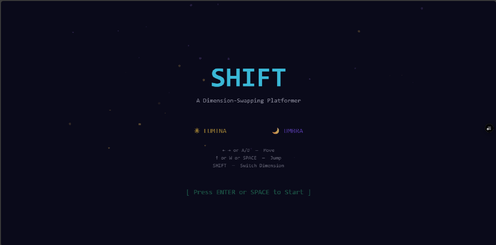
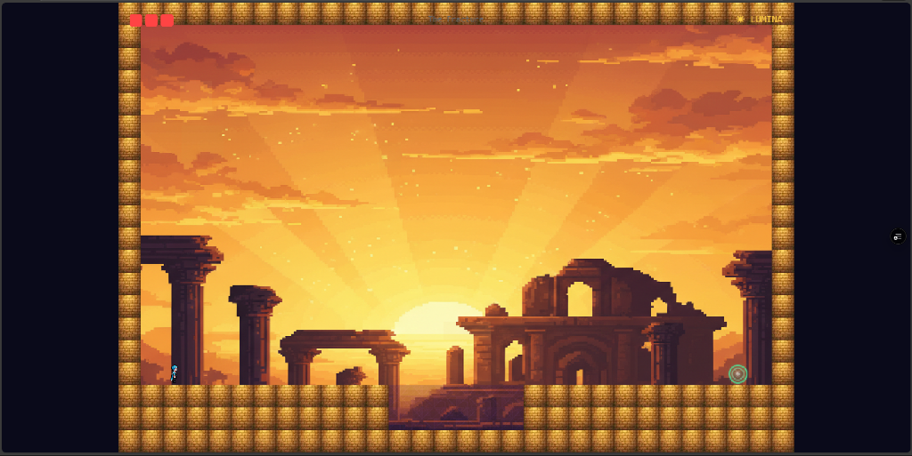
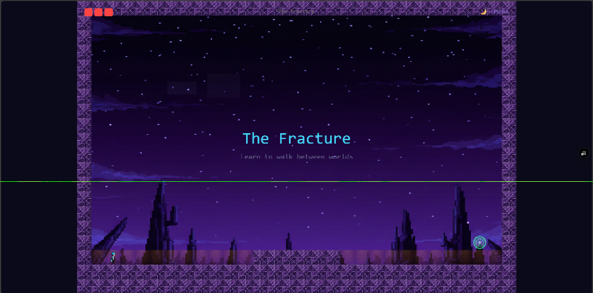
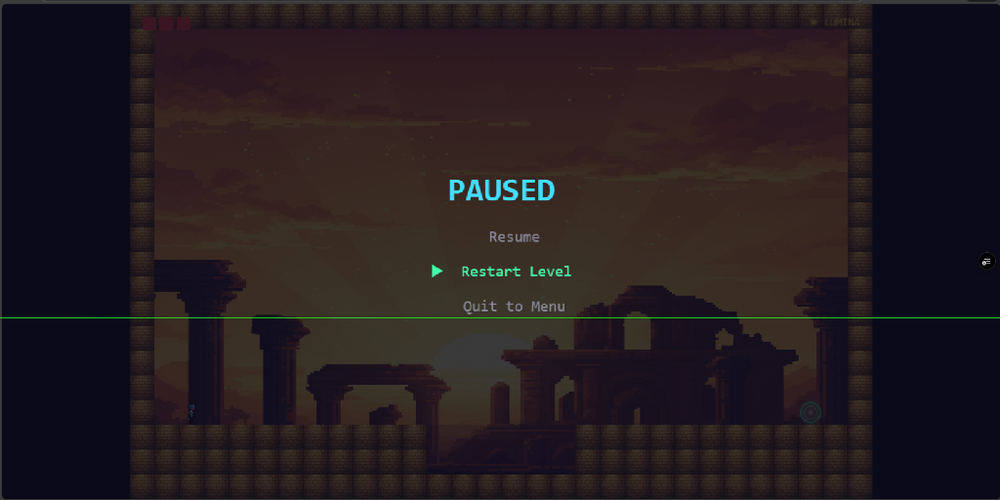

<p align="center">
  <h1 align="center">⚡ SHIFT</h1>
  <p align="center"><strong>A Dimension-Swapping Pixel Art Platformer</strong></p>
  <p align="center">
    Built with <a href="https://phaser.io/">Phaser 3</a> · TypeScript · Vite
  </p>
</p>

---

## 🎮 About

**SHIFT** is a 2D pixel-art platformer where you navigate through **two parallel dimensions** — the warm, golden **Lumina** and the cold, ethereal **Umbra**. Platforms that exist in one dimension may vanish in the other. Master the art of shifting between worlds to overcome obstacles, dodge enemies, and reach the exit.

## ✨ Features

- 🌗 **Dual-Dimension Mechanic** — Swap between Lumina and Umbra mid-jump to reveal hidden paths
- 🗺️ **10 Handcrafted Levels** — Progressive difficulty from tutorial to gauntlet
- 👾 **Patrol Enemies** — Dimension-aware enemies that guard each world
- 🎨 **Procedural Pixel Art** — All textures generated at runtime (zero external sprites)
- 🎵 **Dynamic Audio** — BGM crossfades between dimensions, positional SFX
- ⏸️ **Full Game Flow** — Pause menu (ESC / ⏸), Game Over screen, Victory screen
- 📱 **Mobile Ready** — Touch controls, landscape hints, responsive scaling
- 🏃 **Advanced Movement** — Wall-jumping, coyote time, jump buffering
- 🌌 **Parallax Backgrounds** — Multi-layer scrolling sky, clouds, and cityscape

## 📸 Screenshots

<p align="center">
  
  
</p>
<p align="center">
  
  
</p>

## 🚀 Getting Started

### Prerequisites

- [Node.js](https://nodejs.org/) 18+

### Install & Run

```bash
# Clone the repo
git clone https://github.com/your-username/shift.git
cd shift

# Install dependencies
npm install

# Start dev server
npm run dev
```

Open `http://localhost:5173` in your browser.

### Production Build

```bash
npm run build
npm run preview
```

## 🎮 Controls

### Desktop

| Key                   | Action           |
| --------------------- | ---------------- |
| `← →` or `A/D`        | Move             |
| `↑` or `W` or `SPACE` | Jump             |
| `SHIFT`               | Switch Dimension |
| `ESC`                 | Pause Menu       |
| `↑ ↓` + `ENTER`       | Navigate Menus   |

### Mobile

| Touch         | Action           |
| ------------- | ---------------- |
| `◀ ▶` buttons | Move             |
| `⬆` button    | Jump             |
| `⇄` button    | Switch Dimension |
| `⏸` button    | Pause            |

## 🏗️ Project Structure

```
shift/
├── index.html              # Entry point + mobile viewport setup
├── src/
│   ├── main.ts             # Phaser game config
│   ├── scenes/
│   │   ├── BootScene.ts    # Asset loading + texture generation
│   │   ├── MenuScene.ts    # Title screen
│   │   └── GameScene.ts    # Main gameplay loop + HUD
│   ├── entities/
│   │   ├── Player.ts       # Player movement, combat, states
│   │   └── Enemy.ts        # Patrol AI, dimension awareness
│   ├── systems/
│   │   ├── DimensionManager.ts    # Lumina/Umbra swap logic
│   │   ├── ParallaxBackground.ts  # Multi-layer scrolling
│   │   ├── ParticleManager.ts     # VFX (shift, jump, death)
│   │   ├── CameraManager.ts       # Smooth follow + effects
│   │   ├── AudioManager.ts        # SFX + ambient audio
│   │   └── TouchControls.ts       # Mobile on-screen buttons
│   ├── levels/
│   │   └── LevelData.ts    # 10 levels as tile grids
│   └── utils/
│       ├── Constants.ts     # Global tuning values
│       ├── TextureGenerator.ts  # Procedural sprite creation
│       └── AssetKeys.ts     # Centralized asset key registry
├── assets/                 # Audio files (BGM + SFX)
├── screenshots/            # Game screenshots
├── package.json
└── tsconfig.json
```

## 🎯 Level Progression

| #   | Name          | Mechanic                     |
| --- | ------------- | ---------------------------- |
| 1   | The Fracture  | Tutorial — basic shifting    |
| 2   | Split Path    | Staircase platforming        |
| 3   | Leap of Faith | Mid-air dimension swap       |
| 4   | Shadow Dance  | Tight timing with patrols    |
| 5   | Mirror Maze   | Both dimensions used equally |
| 6   | The Gauntlet  | Chase enemies                |
| 7   | Vertigo       | Vertical climbing            |
| 8   | Duality       | Complex multi-shift puzzle   |
| 9   | The Crucible  | All mechanics combined       |
| 10  | Convergence   | Final gauntlet               |

## 🛠️ Tech Stack

- **Engine**: [Phaser 3](https://phaser.io/) (Arcade Physics)
- **Language**: TypeScript
- **Bundler**: [Vite](https://vitejs.dev/)
- **Art**: 100% procedural (generated at runtime via Canvas API)
- **Audio**: Web Audio API via Phaser's sound manager

## 📄 License

MIT

---

<p align="center">
  <em>Shift between worlds. Find your path.</em>
</p>
